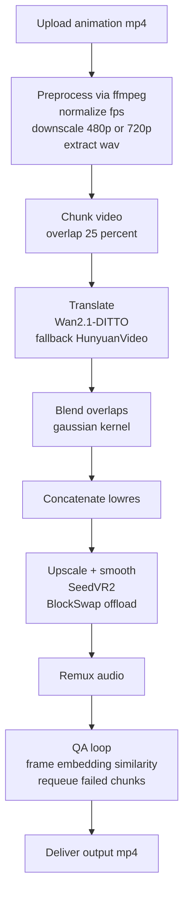

# Live-Action (Animation ➜ Photoreal Video) Implementation Plan

## 0) What this repository will contain

This repo will become a reproducible, single-GPU (H100 80GB) video-to-video pipeline built around:

- Preprocess: FFmpeg normalization (fps/scale/audio split)
- Core translation: `Wan2.1-DITTO` (primary) with `HunyuanVideo-1.5` as fallback
- Long clips: chunking + overlap latent blending; optional `LongLive` for extension
- Refinement: `SeedVR2` upscaling + temporal smoothing
- Serving: FastAPI + single-worker queue to prevent GPU job overlap
- QA loop: per-chunk structural checks (CLIP/embeddings) + auto-regenerate on threshold failure

## 1) Repo bootstrap + agent configuration (Roo)

### 1.1 Project-level modes

Add a project `.roomodes` file defining specialized modes for this repo and tightening tool usage.

Key design points:

- Keep an explicit split between:
  - planning/specification
  - coding/edits
  - debugging/triage
  - model-ops (GPU/memory/perf)
  - eval/QA automation
- Enforce “single-GPU, one-job-at-a-time” assumptions in all modes.

### 1.2 `.roo/` system prompt overrides + per-mode rules

Create `.roo/` content that hard-bakes constraints and best practices so Roo consistently:

- defaults to `bf16`/`fp8` where supported
- uses memory hygiene between pipeline stages
- uses `diffusers` APIs rather than ad-hoc kernels unless required
- never runs two GPU jobs concurrently
- treats video as chunked segments with overlap blending

Proposed files:

- `.roo/system-prompt-base` (global, project specific)
- `.roo/system-prompt-video-pipeline` (pipeline-specific addendum)
- `.roo/rules-architect/*.md` (planning constraints, acceptance criteria)
- `.roo/rules-code/*.md` (coding standards, perf/memory guardrails)
- `.roo/rules-debug/*.md` (OOM playbook, logging requirements)
- `.roo/rules-ask/*.md` (prompting guidance, operational runbooks)
- `.roo/rules-orchestrator/*.md` (delegation rules; orchestrator should not “do” coding)

Also add `.clinerules` + `.clinerules-{mode}` equivalents to reinforce:

- strict memory cleanup between translation and upscaling
- precision enforcement
- library standardization
- OOM retry strategy

## 2) Runtime architecture (high-level)

## 3) Concrete implementation phases (what Code mode will build)

### Phase A — Repo scaffold

- Python packaging with `uv` + pinned dependencies
- baseline CLI: `python -m live_action ...`
- data directories and run artifacts layout

### Phase B — Preprocess module

- FFmpeg wrapper utilities (fps normalize, scale, audio split)
- deterministic extraction of frame counts + metadata

### Phase C — Translation module

- diffusers-based pipeline loading for Wan2.1-DITTO
- configurable denoise strength + guidance + seed
- temporal chunking with overlap + blending
- explicit VRAM hygiene between chunks

### Phase D — Upscale module

- SeedVR2 invocation
- optional offload and block swapping controls

### Phase E — Serving + job queue

- FastAPI ingestion endpoint
- single worker consumer loop
- job state + artifact persistence

### Phase F — QA + regeneration loop

- frame sampler
- embedding comparison
- rule-based requeue with adjusted params

## 4) GitHub repository creation (once scaffold is ready)

After scaffold + Roo config land in the working tree:

- `git init`
- initial commit including plan + Roo config + baseline project files
- authenticate: `gh auth login`
- create private repo + push

## 5) Definition of Done

- `.roomodes` exists and is loadable by Roo
- `.roo/` rules exist for each mode used in this project
- repo is pushed to a private GitHub repository named `live-action`
- documented run path for: preprocess ➜ translate ➜ upscale ➜ remux ➜ QA

## 6) Milestone 2 implementation status

Implemented in codebase:

- Pipeline runtime config contracts in `src/live_action/pipeline/config.py`
- Chunk planning and overlap blending helpers in `src/live_action/pipeline/chunking.py`
- Translation provider abstraction + fallback path in `src/live_action/pipeline/translator.py`
- Upscale stage contract in `src/live_action/pipeline/upscale.py`
- GPU boundary hooks in `src/live_action/runtime/gpu.py`
- Evaluation metrics + requeue policy in:
  - `src/live_action/eval/metrics.py`
  - `src/live_action/eval/requeue.py`
- Deterministic orchestrator state machine in `src/live_action/server/orchestrator.py`
- API extensions for run/chunk visibility in `src/live_action/server/main.py`
- API schema expansion in `src/live_action/server/schemas.py`
- Tests added in `tests/` and runtime checks in `scripts/`

Validation snapshot:

- `python -m compileall src tests scripts` passes.
- `pytest -q` passes.

